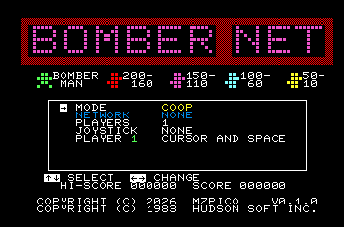
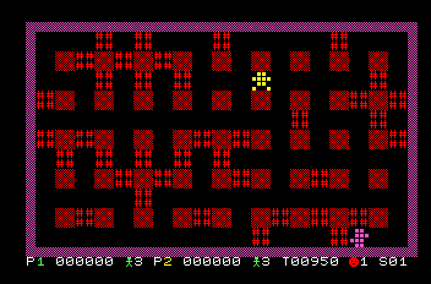
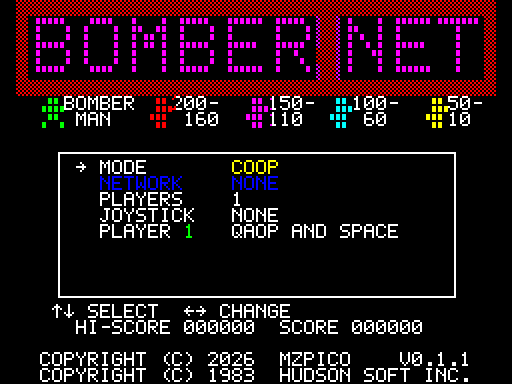
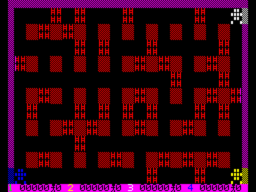

# BomberNet

Bomberman for 8-bit computers, with network play. BomberNet is Hudson Soft's
1983 Bomber Man for the Sharp MZ-700, taken apart, ported to C and rebuilt for
up to four players: cooperative or deathmatch, on one keyboard, on joysticks,
and over the internet. A Sharp MZ-800, a ZX Spectrum and the browser player on
mzpico.com meet in the same room and play the same field frame for frame.

Version 0.2.0 (tag `v0.2.0`, shown at the bottom of the title screen).

 
 

## Play

| Machine | File | Network play with |
|---|---|---|
| Browser | [mzpico.com/play/bombernet](https://mzpico.com/play/bombernet/) (an emulated MZ-800) | built in |
| Sharp MZ-700/800 | `bombernet.mzf` ([catalog page](https://mzpico.com/titles/bombernet/)) | an MZPico with the NET extension; or a Unicard with NET firmware on a LAN (see Network) |
| ZX Spectrum 48K or larger | `bombernet.tap` (`LOAD ""`) | a Spectranet or Spectranext |

The release files are in the repository root and on the catalog page.

**Title menu.** UP/DOWN selects a row, LEFT/RIGHT changes it, SPACE starts.
Rows: MODE (COOP or DEATHMATCH), NETWORK (OFF, HOST, JOIN; greyed out without
a network device), PLAYERS (1 to 4 in total), LOCAL (in a network game: how
many of them sit at this machine), JOYSTICK (the stick interface), then one
row per local player choosing its input. Deathmatch has no monsters, players start
in the corners, the first to win 3 rounds wins the match, a kill scores 100.

| | Sharp MZ | ZX Spectrum |
|---|---|---|
| Keys | cursor keys and SPACE; W A S D and E | Q A O P and SPACE (M when two share the keyboard); Sinclair stick keys 6 7 8 9 0 and 1 2 3 4 5 |
| Joysticks | MZ-800 sticks (ports F0h/F1h), MZ-1X03 | Kempston, Fuller, Cursor (keys 5 to 8 and 0) |
| Cancel | BREAK | BREAK (CAPS SHIFT + SPACE) |

**Network play.** One player chooses HOST: the game creates a room and shows
its four-letter code, which the others need to get by any other means
(message, phone). They choose JOIN and type the code. The host's PLAYERS row
is the total; each machine's LOCAL row says how many of them play there, so
any mix of local and remote players works. In the lobby everybody presses
SPACE when ready, the host last. The input delay (DELAY in the lobby, 120 ms
on most links) is measured before the match. A desync or a lost player ends
the match with a message.

## eLeMeNt / MB03+ with ESP-01 (128K)

The ESP-01 port and hardware-tested release 19 are described in
[ports/esp01/README.md](ports/esp01/README.md), including build instructions,
a reproducible release fixture and remaining hardware checks. Ordinary
Spectrum builds below continue to use Spectranet.

## Building

Z80 builds use z88dk (`sccz80`, `z88dk.zcc`, e.g. the snap package) and CMake;
`-DPLATFORM` selects the machine (default `mz`).

```
mkdir -p build/c  && cd build/c  && cmake ../../c && make                  # -> build/c/bomber.mzf
mkdir -p build/zx && cd build/zx && cmake -DPLATFORM=zx ../../c && make    # -> build/zx/bomber.tap
mkdir -p build/cpc && cd build/cpc && cmake -DPLATFORM=cpc ../../c && make  # -> build/cpc/bomber.cpc, bomber.dsk (in progress)
tools/build_host.sh && c/build/sim 30000 2                                 # the game on a PC (key bot)
```

The MZ build uses the environment of the MZPico-800-Manager (`+mz` target,
`REGISTER_SP=0xd000`, output renamed to `.mzf`); the Spectrum build loads at
24000 and keeps its hot code above the contended RAM.

## Code structure

```
c/core/       the game, identical everywhere: no hardware addresses, no assembly
c/common/     shared building blocks: network devices, Z80 assembly loops
c/platform/   one directory per machine: mz, zx, host (the PC simulator)
```

| path | content |
|---|---|
| `c/core/game.h` | constants, records (`player_t`, `enemy_t`, `bomb_t`, `ftimer_t`), globals, prototypes, `GAME_VERSION`, `BUILD_ID` (bump on any change of the simulation or the protocol) |
| `c/core/platform.h` | **what a port implements**: key sets, joysticks, text-entry key, frame sync, tone, screen flush, player colour, menu texts naming the machine's keys; optional assembly versions of core loops |
| `c/core/netdev.h` | **the network as ten calls**: status, create, join, leave, ready, send, poll, hash, message send and receive |
| `c/core/bomber.c` | title and menu, lobby, stage life cycle, status line, frame order as in the original main loop |
| `c/core/netplay.c` | the lockstep match over the network device |
| `c/core/input.c`, `video.c` | input sampled once per frame; layers, 2x2 tiles, digits and text |
| `c/core/map.c`, `enemy.c`, `bomb.c`, `player.c` | stage layout, enemies, bombs and blast, players |
| `c/core/data.c/.h` | generated by `tools/extract_data.py` from `bomber.mzf`: logo (`tools/make_logo.py`), blast pattern, strings |
| `c/common/netdev_card.c`, `uc.h` | the network device as a Unicard-compatible card (MZPico NET extension, Unicard NET firmware): detection by the INFO feature bit, the ten calls as card commands |
| `c/common/netdev_soft.c`, `ws.c`, `tcp.h` | the network device in software, on the machine itself: room state, input window, messages, JSON lines over a small WebSocket client over any `tcp.h` |
| `c/common/netdev_none.c` | the network device of a build without network |
| `c/common/z80_loops.c` | core loops and text output in Z80 assembly, used by the MZ and the Spectrum |
| `c/platform/mz/` | Sharp MZ-700/800: keyboard matrix, joysticks, tones through the monitor, 8253 frame limiter, screen flush through the display-code tables; `uc_mz.c` is the card transport on ports 50h/51h |
| `c/platform/zx/` | ZX Spectrum 48K: keys and joysticks, frame sync on the ROM's frame counter, beeper, the 6 x 8 pixel screen routine in assembly; `tcp_spectranet.c` is `tcp.h` over the Spectranet socket calls |
| `c/platform/cpc/` | Amstrad CPC (port in progress, `docs/port-amstrad-cpc.md`): Mode 1 in four inks, cells rendered in advance from the MZ characters (`tools/make_cpc_tables.py`), keyboard and joysticks through the PPI, AY tones |
| `c/platform/host/` | the PC: `sim.c` (the whole game with a key bot, recording, replay and a stub network card), `tcp_posix.c` and `softnet_test.c` (the software network device on a PC) |
| `c/platform/*/tables.c/.h` | generated: logical cell codes to the machine's characters and colours (`tools/make_zx_tables.py` for the Spectrum) |
| `c/platform/*/plat_config.h` | the platform's constants: text rows, joystick kinds, which assembly versions exist |

**Adding a machine** means a new `c/platform/<name>/` with `platform.h`
implemented, a `plat_config.h`, character tables, and a network device: the
card protocol if the machine has such a card, otherwise `netdev_soft.c` with a
`tcp.h` for its network interface, or `netdev_none.c`. The core draws 40 x 25
logical cells (rows 0..23 the field, row 24 the status line); a machine with
24 text rows shows the status line on the bottom wall in its flush routine.
Every machine must simulate the same frames: a frame is 60 ms, and recordings
made on the PC replay on each build with identical state hashes.
`docs/port-zx-spectrum.md` records how the Spectrum port was planned and
measured.

## Network

| Device | Machine | Transport to the relay |
|---|---|---|
| MZPico, NET extension | Sharp MZ-800 | WebSocket from the card's firmware (WiFi), production relay |
| Browser player | mzpico.com | the page's WebSocket, production relay |
| Spectranet / Spectranext | ZX Spectrum | WebSocket from the Spectrum itself (`netdev_soft.c`) |
| Unicard, NET firmware | Sharp MZ-800 | JSON lines over TCP: a self-hosted `relay/relay.py` (LAN), not the production relay |

The production relay is `ws://api.mzpico.com/net` (Cloudflare, one Durable
Object per room). `relay/relay.py` is the reference relay for local tests and
self-hosting: WebSocket on 8765, JSON lines over TCP on 8766
(`RELAY_TCP_HOST=0.0.0.0` opens the TCP port to the LAN).

```
cd relay && uvicorn relay:app --host 0.0.0.0 --port 8765
```

A match is lockstep: every frame each machine sends its keys for frame F + d
and waits for everybody's keys of frame F. The host chooses d from the lobby's
round trips (`ceil(rtt / 2)` frames of 60 ms, 2 to 8); hashes of the game state
are compared every 16 frames. Protocol: `docs/net-protocol.md`. Timing
measurements and the reasoning behind the delay rule: `docs/net-timing.md`.

## Testing and tools

| tool | what it checks |
|---|---|
| `c/build/sim` (`SIM_RECORD`, `SIM_REPLAY`) | records a bot session on the PC and replays it with a state hash per frame |
| `tools/replay.py`, `tools/replay_zx.py` | the same recording on the MZ build (mz800emu) and the Spectrum build: identical hashes |
| `tools/lockstep_test.py`, `tools/nettest.py` | two MZ-800s (mz800emu, MZPico card emulated) through the local relay |
| `tools/lockstep_zx.py` | two Spectrums (`tools/zxemu.py`, Spectranet emulated at its programming interface) through the local relay or production |
| `tools/replay_cpc.py`, `tools/lockstep_cpc.py` | the same recordings on the Amstrad CPC build; two CPCs with M4 boards (`tools/cpcemu.py`) through the local relay or production |
| `tools/crossplay.py` | an MZ-800 and a Spectrum in one match |
| `tools/fusex_match.py` | two FuseX with the real Spectranet firmware (`tools/fusex.py` drives FuseX through its GDB server) |
| `tools/softnet_test.sh` | the software network device on a PC: two processes in one room |
| `tools/netbench.py` | network timing of a real-time match, local relay or production, including the play page (`tools/web_join.mjs`, `tools/netproxy.py`) |
| `tools/browser_match.mjs` | two browser tabs play a match on the site |
| `tools/emu.py` | drives a headless mz800emu over its MCP pipe: load, keys, frame benchmarks, screenshots |
| `tools/cpcemu.py`, `tools/cpcemu_selftest.py` | a scripted Amstrad CPC with an M4 board (sockets emulated at its port interface) for the CPC port, and its self-test |

```
SIM_MODE=1 SIM_PLAYERS=2 SIM_SEED=0x1234 SIM_RECORD=build/replay/dm.bnr c/build/sim 3000 7
SIM_REPLAY=build/replay/dm.bnr c/build/sim 3000 99     # PC replay, different bot seed
tools/replay.py build/replay/dm.bnr                    # the same recording on the MZ build
tools/replay_zx.py build/replay/dm.bnr                 # and on the Spectrum build
```

The emulator paths come from `$MZ800EMU` (default
`~/src/mz800emu/build/build-mz800emu/mz800emu`) and `$FUSEX`. The network tests
need the local relay (above); FuseX needs a virtual display (`Xvfb :97`).
Building FuseX and its quirks: `docs/port-zx-spectrum.md`.

## The original

`bomber.mzf` is the untouched 1983 tape; `bomber.asm` is its complete,
commented disassembly, which `./build.sh` reassembles byte-identical with
`pasmo`. Memory map, rendering model, data structures, quirks, what the C port
changed on purpose and how fast it runs: `docs/original.md`.

## Documents

| file | content |
|---|---|
| `docs/original.md` | the 1983 original: memory map, rendering, data structures, quirks; the C port's deliberate changes and performance |
| `docs/net-protocol.md` | the network device (card commands, ten calls) and the relay protocol |
| `docs/net-timing.md` | network timing measurements and the 0.2.0 fixes |
| `docs/port-zx-spectrum.md` | the ZX Spectrum port: feasibility, plan, measurements, FuseX |
| `docs/port-amstrad-cpc.md` | the Amstrad CPC port with the M4 board: feasibility and plan |
| `PLAN.md` | the multiplayer plan the C port followed |
