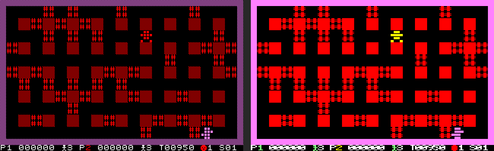

# BomberNet on the Amstrad CPC: feasibility and plan

Target: an Amstrad CPC 464 (64 KB) or larger, local play for 1 to 4, and
network play with the **M4 board**, in the same rooms as the MZ-800, the ZX
Spectrum and the browser player. Chosen over MSX and the Spectrum Next for
its Z80, its large community, and a network card that most networked CPCs
have (comparison in the conversation of 5 October 2026; MSX remains the next
candidate: one standard API, UNAPI, over many cards, but weak emulator
support).

## 1. The machine

| Item | CPC | What it means for the port |
|---|---|---|
| CPU | Z80 at 4 MHz, every instruction stretched to whole microseconds (about 3.3 MHz effective) | about the Spectrum's speed; the Spectrum's assembly loops carry over |
| RAM | 64 KB; the screen takes 16 KB (C000h–FFFFh) | about 48 KB below the screen with the firmware switched off |
| Screen | Mode 0: 160 x 200, 16 of 27 colours; Mode 1: 320 x 200, 4 colours | both give **40 x 25 cells of 8 x 8 screen pixels: exactly the MZ field and status line**. A cell is 2 bytes x 8 lines, byte aligned (no 6-pixel packing as on the Spectrum) |
| Frame | 50 Hz, interrupt every 52 lines (300 Hz), VSYNC readable on the PPI | a game frame is 3 TV frames (60 ms), as on the Spectrum |
| Sound | AY-3-8912 through the PPI | the MZ's tones as square waves; the game need not wait while a tone plays |
| Keyboard | 10 x 8 matrix scanned through the PPI and the AY's port A | a keyboard player on cursor keys or Q A O P, the second on W A S D |
| Joysticks | a joystick port on every model (matrix row 9); a second stick through the usual splitter (row 6) | two sticks without an interface: up to 4 players with two on the keyboard |

## 2. Screen mode: Mode 0 with redrawn glyphs

The MZ field uses six colours (black, red bricks and walls, magenta outer wall,
white, yellow, green) plus the enemies' colours, and each player has its own
colour. Mock-up from an MZ screenshot (left Mode 1, right Mode 0, both naive
conversions):

- **Mode 1** keeps every pixel of the MZ characters but has 4 colours: the
  players and the enemy types can no longer be told apart by colour.
- **Mode 0** keeps the colours, but a cell is 4 wide pixels. Converted
  naively the dithered walls become solid and the text unreadable; the 79
  glyphs need redrawing for 4 x 8, as they were narrowed to 6 x 8 for the
  Spectrum (`tools/make_zx_tables.py`). Most CPC games use Mode 0.

Proposal: Mode 0, glyphs redrawn by a generator plus hand corrections,
decided on a rendered mock-up of real glyphs in step 2 before the screen
routine is written. Each cell is then 16 bytes with its colours built in, so
flushing a changed cell is a 16-byte copy (the Spectrum needs 6-pixel
shifting and an attribute rule; the CPC has no attribute clash).

## 3. Network: the M4 board

Measured from the M4's own sources (github.com/M4Duke: `m4rom/m4cmds.i`,
`M4examples/tcp.s`, `lookup.s`; firmware 1.0.9 and later, current 2.x):

- **Commands** are sent as a packet to port FE00h (one OUT per byte:
  length, command word, parameters) and started with an OUT to FC00h.
- **Answers** are in a buffer inside the M4's ROM: its address is at FF02h,
  the socket status table's at FF06h. The M4 ROM must be paged in at
  C000h–FFFFh to read them (ROM number found once by its name "M4 BOARD").
  Writes still go to the screen RAM underneath; the game never reads the
  screen, so paging the ROM in for a moment costs nothing else.
- **Sockets**: C_NETSOCKET (4331h, TCP only), C_NETCONNECT (4332h: socket, IP,
  port), C_NETSEND (4334h, up to 255 bytes per packet), C_NETRECV (4335h), C_NETCLOSE
  (4333h), and C_NETHOSTIP (4336h) for DNS. Connect and DNS are
  asynchronous: the socket status shows "in progress" until done. The status
  table also gives the bytes waiting, so polling costs no command.

This is a plain TCP socket like the Spectranet's. The Spectrum's software
network device and WebSocket client (`c/common/netdev_soft.c`, `ws.c`) run
unchanged on top of a new `c/platform/cpc/tcp_m4.c`; the relay is the same
`api.mzpico.com`, no server change.

## 4. Emulation

| Emulator | M4 | Use |
|---|---|---|
| **CPCemu** (cpc-emu.org; Windows, macOS, Linux/SDL) | full M4 emulation including TCP connections and HTTP (CPCemu's own description; its release notes name the Windows version for M4 changes: Linux support to be checked) | manual checks with the real M4 ROM, as FuseX was for the Spectranet |
| **`tools/cpcemu.py`** (to be written) on the `z80` Python package (Z80 core with memory and port callbacks, installed in `build/venv`) | the M4 at its port interface with real sockets, as `tools/zxemu.py` emulates the Spectranet | scripted tests: replays, lockstep, cross-play |
| WinAPE, ACE-DL, Caprice32, Retro Virtual Machine | no M4 networking found | local play only |

## 5. Build

z88dk builds for the CPC (`+cpc`): checked with a test program, which came
out as an AMSDOS file (`.cpc`) and, with `-subtype=dsk`, a disc image. The
release would be `bombernet.dsk` (CPC 6128, and the M4 mounts disc images)
plus the AMSDOS file for the M4's SD card. Size: the Spectrum program with
buffers is 40.4 KB; the CPC loses the Spectrum's 6-pixel tables but gains
16-byte glyphs (256 codes x 16 = 4 KB) and a smaller screen routine.
Estimate 41–43 KB of the 48 KB, to be measured in step 2.

## 6. Plan

| Step | Work | Result | Effort |
|---|---|---|---|
| 0 | Feasibility: M4 interface, emulators, build, screen mode | this document | done |
| 1 | `tools/cpcemu.py`: CPC subset on the `z80` core (64 KB, ROM paging, gate array mode and palette, PPI keyboard and VSYNC, interrupts, screenshot), M4 at its port interface with real sockets | scripted CPC for every later step | 2 days |
| 2 | CPC platform, local play: `+cpc` build to `.dsk`, Mode 0 glyph tables (mock-up first), 16-byte cell flush, keyboard, two joysticks, frame sync, AY tones | playable local game, 1 to 4 players | 6 days |
| 3 | Determinism: PC recordings replayed on the CPC build, hashes compared | same simulation as MZ and Spectrum | 1 day |
| 4 | `tcp_m4.c` under the existing software network device; local relay, then production | CPC against CPC | 3 days |
| 5 | Cross-play: CPC with MZ, Spectrum and the browser player in one room | the goal | 1 day |
| 6 | Fit and speed: memory map, assembly where frames run long | holds 60 ms frames on a 464 | 2 days |
| 7 | CPCemu with the M4 ROM; then a real CPC with an M4 (a tester from the community) | validated release | 1 day + hardware |

About three and a half weeks, less than the Spectrum: the core split, the
network device and the test tools exist.

## 7. Risks

| Risk | Severity | Mitigation |
|---|---|---|
| 4 x 8 glyphs read poorly | Medium | mock-up of real glyphs before the screen routine; Mode 1 stays possible (4 colours, players told apart by shape) |
| M4 answers are slow per frame (command, then waiting for the Cortex M4) | Medium | measure in step 4 as on the Spectrum; poll the status table, send one packet per frame |
| CPCemu's M4 networking only on Windows | Low | `tools/cpcemu.py` covers the scripted tests; CPCemu runs on Windows for the manual check |
| Memory on a 464 | Low | estimate leaves 5–7 KB; the firmware is switched off |
| Firmware off breaks the M4 | Low | the M4 is driven by ports only; the ROM is paged by the gate array directly |
