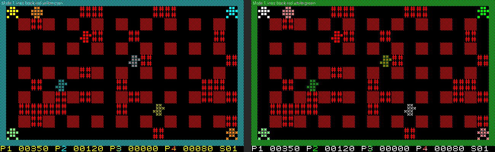
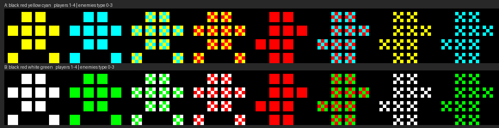
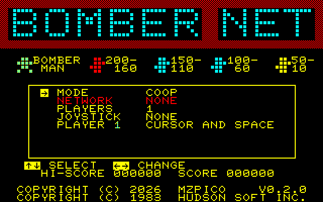
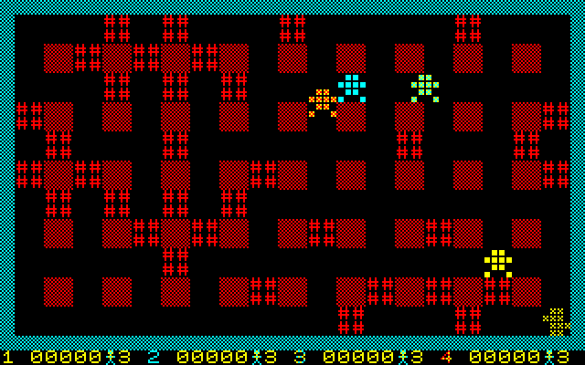
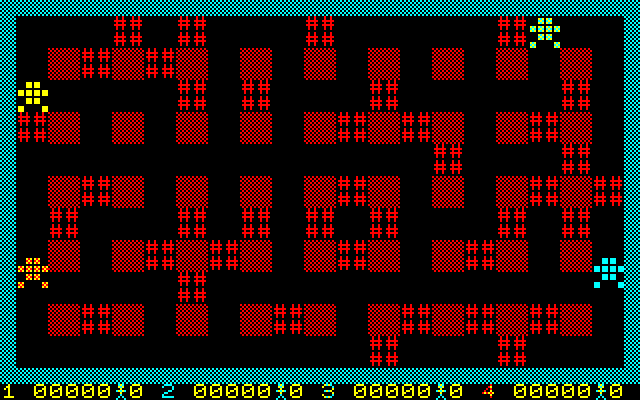

# BomberNet on the Amstrad CPC: feasibility and plan

Target: an Amstrad CPC 464 (64 KB) or larger, local play for 1 to 4, and
network play with the **M4 board**, in the same rooms as the MZ-800, the ZX
Spectrum and the browser player. Chosen over MSX and the Spectrum Next for
its Z80, its large community, and a network card that most networked CPCs
have (comparison in the conversation of 5 October 2026; MSX remains the next
candidate: one standard API, UNAPI, over many cards, but weak emulator
support).

## 1. The machine

| Item | CPC | What it means for the port |
|---|---|---|
| CPU | Z80 at 4 MHz, every instruction stretched to whole microseconds (about 3.3 MHz effective) | about the Spectrum's speed; the Spectrum's assembly loops carry over |
| RAM | 64 KB; the screen takes 16 KB (C000h–FFFFh) | about 48 KB below the screen with the firmware switched off |
| Screen | Mode 0: 160 x 200, 16 of 27 colours; Mode 1: 320 x 200, 4 colours | both give **40 x 25 cells of 8 x 8 screen pixels: exactly the MZ field and status line**. A cell is 2 bytes x 8 lines, byte aligned (no 6-pixel packing as on the Spectrum) |
| Frame | 50 Hz, interrupt every 52 lines (300 Hz), VSYNC readable on the PPI | a game frame is 3 TV frames (60 ms), as on the Spectrum |
| Sound | AY-3-8912 through the PPI | the MZ's tones as square waves; the game need not wait while a tone plays |
| Keyboard | 10 x 8 matrix scanned through the PPI and the AY's port A | a keyboard player on cursor keys or Q A O P, the second on W A S D |
| Joysticks | a joystick port on every model (matrix row 9); a second stick through the usual splitter (row 6) | two sticks without an interface: up to 4 players with two on the keyboard |

## 2. Screen mode: Mode 1, palette black red yellow cyan, dithered figures

The MZ field uses six colours (black, red bricks and walls, magenta outer wall,
white, yellow, green) plus the enemies' colours, and each player has its own
colour. Mock-up from an MZ screenshot (left Mode 1, right Mode 0, both naive
conversions):

- **Mode 1** keeps every pixel of the MZ characters but has 4 colours: the
  players and the enemy types can no longer be told apart by colour.
- **Mode 0** keeps the colours, but a cell is 4 wide pixels. Converted
  naively the dithered walls become solid and the text unreadable; the 79
  glyphs need redrawing for 4 x 8, as they were narrowed to 6 x 8 for the
  Spectrum (`tools/make_zx_tables.py`). Most CPC games use Mode 0.

Mode 1 with dithered figures: the four inks are black, red (bricks, pillars)
and two more; a player or an enemy gets one ink or a checkerboard of two, so
four players and four enemy types stay apart while every MZ pixel is kept.
Rendered from the MZ character ROM, two palettes (black red yellow cyan;
black red white green):

Players: ink A, ink B, A/B checker, A/red checker. Enemies: red, B/red
checker, A/black and B/black checkers (darker). At normal size the checkers
read as mixed colours (orange, pale green). The dark enemy checkers resemble
players 1 and 2 at a glance; the status line keeps the players' colours on
their digits.

**Decision (5 October 2026): Mode 1, palette A** (black, red, yellow, cyan).
Every MZ pixel is kept and the glyphs come straight from the MZ character
ROM: no redrawing, no glyph-quality risk. Each cell is 16 bytes with its inks
built in, so flushing a changed cell is a 16-byte copy (no 6-pixel shifting
and no attribute rule as on the Spectrum). To settle on the real screen in
step 2: the enemies' mixes (perhaps only red-based ones, leaving the bright
inks to the players) and the outer wall's ink.

## 3. Network: the M4 board

Measured from the M4's own sources (github.com/M4Duke: `m4rom/m4cmds.i`,
`M4examples/tcp.s`, `lookup.s`; firmware 1.0.9 and later, current 2.x):

- **Commands** are sent as a packet to port FE00h (one OUT per byte:
  length, command word, parameters) and started with an OUT to FC00h.
- **Answers** are in a buffer inside the M4's ROM: its address is at FF02h,
  the socket status table's at FF06h. The M4 ROM must be paged in at
  C000h–FFFFh to read them (ROM number found once by its name "M4 BOARD").
  Writes still go to the screen RAM underneath; the game never reads the
  screen, so paging the ROM in for a moment costs nothing else.
- **Sockets**: C_NETSOCKET (4331h, TCP only), C_NETCONNECT (4332h: socket, IP,
  port), C_NETSEND (4334h, up to 255 bytes per packet), C_NETRECV (4335h), C_NETCLOSE
  (4333h), and C_NETHOSTIP (4336h) for DNS. Connect and DNS are
  asynchronous: the socket status shows "in progress" until done. The status
  table also gives the bytes waiting, so polling costs no command.

This is a plain TCP socket like the Spectranet's. The Spectrum's software
network device and WebSocket client (`c/common/netdev_soft.c`, `ws.c`) run
unchanged on top of a new `c/platform/cpc/tcp_m4.c`; the relay is the same
`api.mzpico.com`, no server change.

## 4. Emulation

| Emulator | M4 | Use |
|---|---|---|
| **CPCemu** (cpc-emu.org; Windows, macOS, Linux/SDL) | full M4 emulation including TCP connections and HTTP (CPCemu's own description; its release notes name the Windows version for M4 changes: Linux support to be checked) | manual checks with the real M4 ROM, as FuseX was for the Spectranet |
| **`tools/cpcemu.py`** (to be written) on the `z80` Python package (Z80 core with memory and port callbacks, installed in `build/venv`) | the M4 at its port interface with real sockets, as `tools/zxemu.py` emulates the Spectranet | scripted tests: replays, lockstep, cross-play |
| WinAPE, ACE-DL, Caprice32, Retro Virtual Machine | no M4 networking found | local play only |

## 5. Build

z88dk builds for the CPC (`+cpc`): checked with a test program, which came
out as an AMSDOS file (`.cpc`) and, with `-subtype=dsk`, a disc image. The
release would be `bombernet.dsk` (CPC 6128, and the M4 mounts disc images)
plus the AMSDOS file for the M4's SD card. Size: the Spectrum program with
buffers is 40.4 KB; the CPC loses the Spectrum's 6-pixel tables but gains
16-byte glyphs (256 codes x 16 = 4 KB) and a smaller screen routine.
Estimate 41–43 KB of the 48 KB, to be measured in step 2.

## 6. Plan

| Step | Work | Result | Effort |
|---|---|---|---|
| 0 | Feasibility: M4 interface, emulators, build, screen mode | this document | done |
| 1 | `tools/cpcemu.py`: CPC subset on the `z80` core (64 KB, ROM paging, gate array mode and palette, PPI keyboard and VSYNC, interrupts, screenshot), M4 at its port interface with real sockets | scripted CPC for every later step; done | 2 days |
| 2 | CPC platform, local play: `+cpc` build to `.dsk`, Mode 1 tables from the MZ character ROM with the dither schemes, 16-byte cell flush, keyboard, two joysticks, frame sync, AY tones | playable local game, 1 to 4 players; done (in `tools/cpcemu.py`) | 5 days |
| 3 | Determinism: PC recordings replayed on the CPC build, hashes compared | same simulation as MZ and Spectrum; done: 8 recordings, 4,268 frames, no mismatch | 1 day |
| 4 | `tcp_m4.c` under the existing software network device; local relay, then production | CPC against CPC | 3 days |
| 5 | Cross-play: CPC with MZ, Spectrum and the browser player in one room | the goal | 1 day |
| 6 | Fit and speed: memory map, assembly where frames run long | holds 60 ms frames on a 464 | 2 days |
| 7 | CPCemu with the M4 ROM; then a real CPC with an M4 (a tester from the community) | validated release | 1 day + hardware |

About three weeks, less than the Spectrum: the core split, the
network device and the test tools exist.

## Measured after step 1

`tools/cpcemu.py` (needs `pip install z80` in `build/venv`) and its self-test
`tools/cpcemu_selftest.py`, Z80 code assembled with pasmo:

| Check | Result |
|---|---|
| Gate array interrupt | 300 interrupts in 0.999 s of CPC time |
| VSYNC on the PPI | 50 rising edges per second |
| Keyboard through PPI and AY register 14 | SPACE (line 5 bit 7), joystick left and fire (line 9 bits 2 and 5) read as on a CPC |
| Mode 1, palette A | screenshot shows the four inks in the right pens |
| M4 board | ROM found by its name in the RSX table, pointer table at FF00h, DNS, socket, connect, send, receive poll in the socket table, receive: an HTTP request to the local relay comes back (154 bytes) |
| Speed | one second of CPC time in under 10 ms of wall time |

The M4 interface was taken from the M4's own ROM source (`m4rom/M4ROM.s`:
the pointer table at FF00h, the socket table layout documented there) and
its examples (`M4examples/tcp.s`, `lookup.s`: packet layout, waiting on the
status bytes). The real M4 firmware is checked against it in step 7, in
CPCemu.

Not modelled: CPC wait states (frame costs optimistic by about 20 %), the
CRTC beyond the screen address, sound output (AY tone writes are recorded),
the CPC firmware (the game does not use it).

## Measured after step 2

  

| Item | Result |
|---|---|
| Program (`build/cpc/bomber.cpc`, no network yet) | 34.6 KB from 1200h; also `bomber.dsk` |
| Tables (`tools/make_cpc_tables.py`) | 79 MZ glyphs, 9 colour schemes, 179 cells rendered in advance: 4.8 KB |
| Frame work, 4 players (plain Z80 at 4 MHz) | median 38.9 ms, 90th percentile 53.9 ms; a real CPC about 20 % more: 47 and 65 ms |
| Frame work, 1 player | median 35.3 ms |
| Sound | each MZ tone becomes an AY channel A tone of the same pitch and length |

How it is built:

- The game starts through z88dk's CPC start-up (firmware still running,
  bank loader and firmware interrupt chain switched off) and takes the
  machine over in `plat_init`: an interrupt counter of its own at 38h
  (300 per second; a game frame is 18), both ROMs paged out, Mode 1, the
  palette, the CRTC's screen address.
- Players 1 to 4 are yellow, cyan, yellow/cyan and yellow/red (orange); the
  enemy types red, cyan/red, yellow/black and cyan/black. Blue MZ text (the
  greyed NETWORK row) is red: a checkerboard does not read on letters.
- `flush_screen` compares the 1000 cells in an unrolled loop (36 T-states an
  unchanged cell, about 9 ms) and copies a changed cell from the cells
  rendered in advance (about 600 T-states). Only the players' shared death
  frames, recoloured per player, are drawn from glyph and lookup table.
- Inputs: cursor keys and SPACE (COPY when two share the keyboard), W A S D
  and E, the joystick port and a second stick on matrix line 6; JOYSTICK
  CPC in the menu switches the sticks on. Text entry: letters, DEL, ESC.

Left for step 6: the frames over 60 ms (the scan could halve), and the load
address: from 1200h the program with network code would pass the end of the
area AMSDOS can load into (A6FFh).

## Measured after step 3

`tools/replay_cpc.py` replays a recording made by the PC simulator on the
CPC build and compares the state hash every frame:

| Recording | Frames | Mismatches |
|---|---|---|
| `build/ref/coop1`, `coop4`, `dm2`, `dm4` | 299 + 499 + 499 + 499 | 0 |
| `build/replay/coop1`, `coop2s`, `dm2`, `dm2s` | 865 + 319 + 993 + 319 | 0 |

The long recordings outlast their match; the replay tools (also
`tools/replay_zx.py`) now stop when the game is back on the title, where
they used to wait for ever.

## 7. Risks

| Risk | Severity | Mitigation |
|---|---|---|
| Dithered figures hard to tell apart in a busy game | Low | players have the bright inks; enemy mixes tried on the real screen in step 2 |
| M4 answers are slow per frame (command, then waiting for the Cortex M4) | Medium | measure in step 4 as on the Spectrum; poll the status table, send one packet per frame |
| CPCemu's M4 networking only on Windows | Low | `tools/cpcemu.py` covers the scripted tests; CPCemu runs on Windows for the manual check |
| Memory on a 464 | Low | estimate leaves 5–7 KB; the firmware is switched off |
| Firmware off breaks the M4 | Low | the M4 is driven by ports only; the ROM is paged by the gate array directly |
